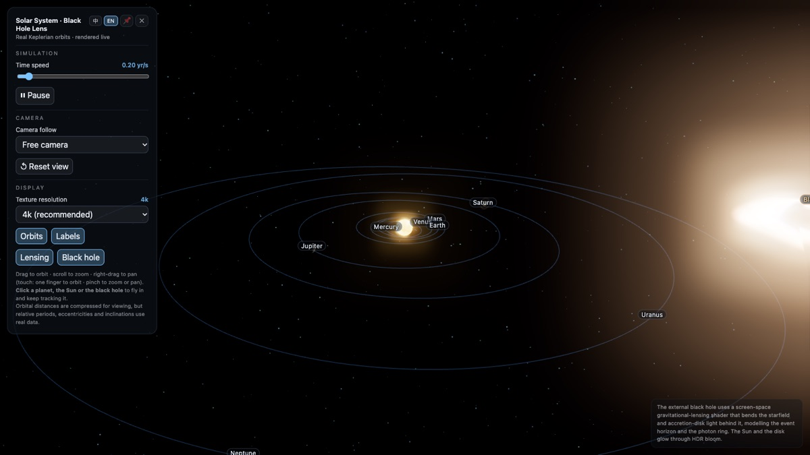
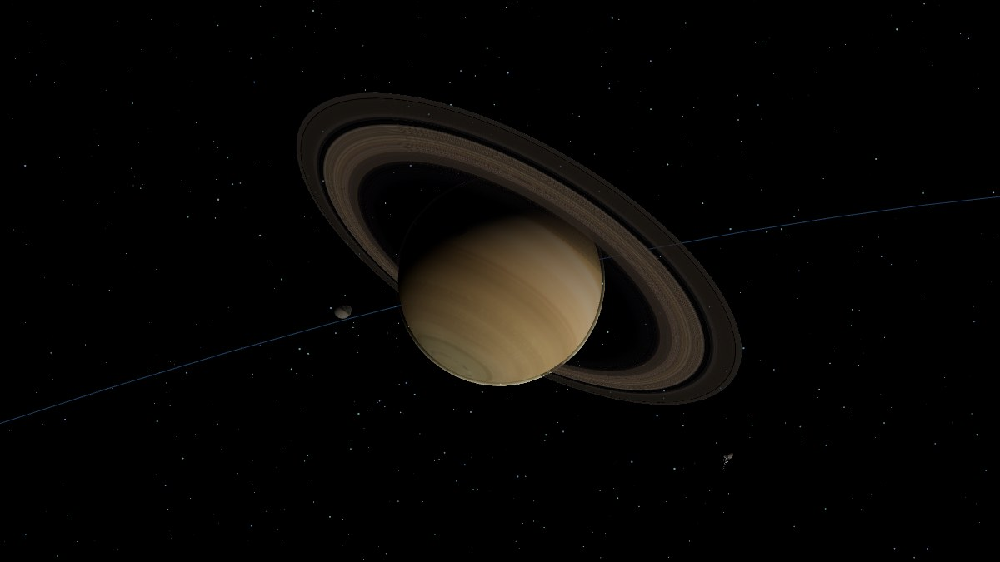
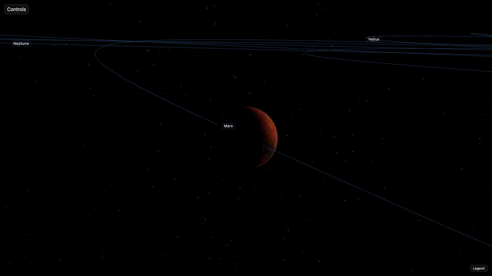
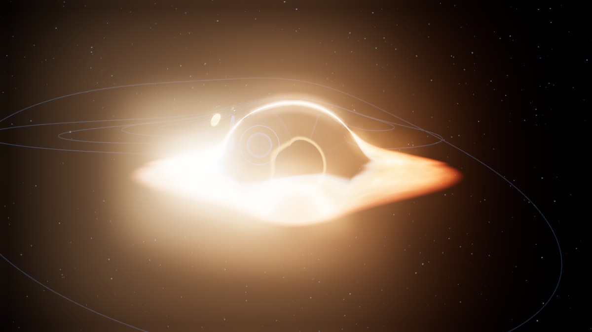

# Solar System · Black Hole Gravitational Lensing

[](https://github.com/7ohnkuu/universe/actions/workflows/ci.yml)

**太陽系 · 黑洞引力透鏡** — a real-time, browser-based solar system built on
[three.js](https://threejs.org): eight planets plus **Pluto** on **true Keplerian
orbits** (Kepler's equation solved every frame), plus an external black hole whose
screen-space **gravitational-lensing shader** bends the starfield and the
accretion disk behind it. A switchable second scene adds the **TRAPPIST-1**
exoplanet system with its real resonance chain.

No build step, no framework, no bundler — three source files, served as static
assets.

<p align="center">
  
</p>

Live features: HDR bloom · point-light shadow casting · Earth's cloud layer,
ocean specular, night-side city lights and **lightning** · Saturn's rings with
**analytic ring shadow** and **view-dependent brightness** · the Moon and the
galilean/Saturnian moons · a **Pluto–Charon binary** orbiting a shared barycenter
· a **main-belt + Kuiper-belt GPU particle field** with real Kirkwood gaps ·
**Jupiter differential rotation** · **two-wavelength Rayleigh** atmospheres ·
**axis-tilt indicators** · an honest **8k fallback badge** · click-to-fly-and-track
· zh-TW / English UI · switchable **TRAPPIST-1** system.

| Saturn, seen near pole-on: ring system and polar region | Mars, terminator crossing the disc |
|---|---|
|  |  |

---

## Table of contents

- [Quick start](#quick-start)
- [Why it looks the way it does](#why-it-looks-the-way-it-does)
  - [True orbital mechanics, compressed distances](#true-orbital-mechanics-compressed-distances)
  - [The black hole](#the-black-hole)
  - [The soft terminator (and a bloom bug it caused)](#the-soft-terminator-and-a-bloom-bug-it-caused)
- [Controls](#controls)
  - [Keyboard](#keyboard)
- [The Dyson shell](#the-dyson-shell)
- [The wormhole](#the-wormhole)
  - [The microlensing light curve](#the-microlensing-light-curve)
- [Moons, and a comet](#moons-and-a-comet)
- [Pluto–Charon binary](#plutocharon-binary)
- [Asteroid belt and Kuiper belt](#asteroid-belt-and-kuiper-belt)
- [TRAPPIST-1: a second system](#trappist-1-a-second-system)
- [Planet-shading upgrades](#planet-shading-upgrades)
- [Project layout](#project-layout)
- [Textures](#textures)
- [Internationalization](#internationalization)
- [Auto-hiding UI](#auto-hiding-ui)
- [Loading](#loading)
- [Not running while you are away](#not-running-while-you-are-away)
- [Performance notes](#performance-notes)
- [Browser support](#browser-support)
- [Deployment](#deployment)
- [Development](#development)
- [Contributing](#contributing)
- [License](#license)

---

## Quick start

**Live demo:** <https://universe-johnkuu.vercel.app> — no install, no build.

The page uses ES modules and an [import map](https://developer.mozilla.org/en-US/docs/Web/HTML/Attributes#use_of_an_import_map),
so it **must be served over HTTP** — opening `index.html` with `file://` will
fail on CORS. Any static server works:

```bash
git clone https://github.com/7ohnkuu/universe.git
cd universe

python3 -m http.server 8000
# then open http://localhost:8000/
```

Other one-liners:

```bash
npx serve .                 # Node
php -S localhost:8000       # PHP
```

**Optional — 8k textures.** The repo ships 2k and 4k maps (4k is the default,
so nothing is missing to run). The 68 MB of 8k maps are not committed; fetch
and checksum them with:

```bash
./scripts/fetch-textures.sh
```

Requires macOS/Linux with `curl` and `sha256sum` or `shasum`. Re-running it is
free — existing files are verified and skipped. If an 8k file is missing, the
page still works: `loadTex()` handles per-file failure and degrades to the
procedural textures with a `console.warn`, so quality drops but nothing breaks.

---

## Why it looks the way it does

### True orbital mechanics, compressed distances

Every planet is propagated by solving **Kepler's equation** rather than being
slid around a circle:

```js
// M = E - e·sin(E)   → Newton–Raphson, 8 iterations
function solveKepler(M, e){
  M = M % TWO_PI; if (M < 0) M += TWO_PI;
  let E = e < 0.8 ? M : Math.PI;
  for (let i = 0; i < 8; i++) E -= (E - e*Math.sin(E) - M) / (1 - e*Math.cos(E));
  return E;
}
```

The orbital elements are the real values — semi-major axis, eccentricity,
period, inclination, longitude of ascending node, argument of perihelion, axial
tilt and sidereal rotation period (Venus and Uranus rotate retrograde, hence the
negative `spinHr`). So Mercury really does lap the Sun 4.15 times per Earth
year, Mercury's orbit is visibly non-circular because its real eccentricity is
0.206, and Uranus really does roll on its side at 97.8°.

Two things *are* compressed, and the panel says so rather than letting you
quietly absorb a lie:

> Orbital distances are compressed for viewing, but relative periods,
> eccentricities and inclinations use real data.

**Distance.** Raw AU values would put Neptune 77× farther out than Mercury,
which is unwatchable. Orbital radii are scaled as:

```js
const distScale = a => Math.pow(a, 0.65) * DIST_K;   // a^0.65, not linear
```

A sub-linear power keeps the ordering and the *shape* of the spacing while
pulling the outer planets into frame.

**The Sun's size.** Planet radii are genuinely proportional to each other —
`rDisp = (radiusKm / 69911) * 8`, so Earth is 0.73× Jupiter and Mercury is
0.28×, exactly right. The Sun is not: at that scale it should be ~80 units
against Jupiter's 8, and it is set to 16. A true-scale Sun would fill the frame
and swallow the inner planets, so it is deliberately shrunk about 5×.
Planet-to-planet sizes are honest; Sun-to-planet size is a trade you should know
about.

### The black hole

The black hole is not a mesh effect — it is a **full-screen post-processing
pass** inserted between the render and the bloom:

```
RenderPass → LensingPass (screen-space deflection) → UnrealBloomPass → OutputPass
```

The shader displaces screen-space UVs as a function of the impact parameter
relative to the black hole's projected position, which produces the three
signatures you actually expect:

- **the shadow** — a true dead zone where nothing is sampled;
- **the photon ring** — a narrow, bright Gaussian ring at ≈1.06× the apparent
  horizon radius, from light that skimmed the photon sphere;
- **the lensed far side of the disk** — the back of the accretion disk is
  bent up and over the shadow, which is why the silhouette reads as an arc
  *above* the hole rather than a flat ellipse.

Because it is screen-space, it correctly lenses the **starfield and the planets**
that happen to fall behind it, not just the disk.

The black hole's screen position and apparent radius are re-derived each frame
by projecting its world position, and the strength uniform is forced to zero
unless the projection **succeeded this frame**. That guard is not pedantry: the
center of a black hole is, by definition, a region that produces no sample, so
reusing last frame's `bhUV` when the current projection fails (behind the
camera, or off-screen) leaves a photon ring floating over empty space. That
regression was reproduced and confirmed before the guard went in — hence the
explicit "only if projected this frame" condition rather than a plain smooth
ramp.

<p align="center">
  
</p>

The composer renders into its own `WebGLRenderTarget` with `samples: 4`,
because MSAA on the default framebuffer is bypassed once you render to a target:

```js
const composerRT = new THREE.WebGLRenderTarget(innerWidth, innerHeight,
  { type: THREE.HalfFloatType, samples: 4 });
```

`HalfFloatType` is what keeps bloom in HDR — the Sun and the disk are the two
things deliberately pushed above the 2.0 bloom threshold, and an 8-bit target
would clip them flat at 1.0 before the threshold ever saw them.

### The soft terminator (and a bloom bug it caused)

Planets lit by a single point light have a hard, cartoonish day/night boundary.
The fix is *wrap lighting*: widen the diffuse falloff across the terminator.

The naive implementation rewrites `dotNL`. **That is a trap.** In three.js's
`RE_Direct_Physical`, the same `dotNL` feeds both diffuse and specular:

```glsl
vec3 irradiance = dotNL * directLight.color;
reflectedLight.directSpecular += irradiance * BRDF_GGX(...);
```

Wrap-lighting `dotNL` injects light into the night side, where
`V_GGX_SmithCorrelated = 0.5 / max(gv + gl, EPSILON)` degenerates toward
`0.5 / EPSILON` (≈5×10⁵). Combined with a mis-sampled texel from the
`normalBias`-offset shadow map, this burns **single-pixel HDR values of
luminance 20–500** onto the terminator — far above the bloom threshold of 2.
`UnrealBloomPass`'s mip chain then smears each one into a square white blob
beside the planet. That was the reported "planets flicker" bug.

Stock `saturate()` is what masks the singularity, so the correct fix is not to
clamp harder but to **leave `dotNL` completely alone** and define a separate
term used *only* for diffuse:

```js
const WRAP_DECL = 'float dotNLwrap = pow( saturate( ( dot( geometryNormal,' +
  ' directLight.direction ) + uWrap ) / ( 1.0 + uWrap ) ), 1.0 + uWrap );';
// injected in place of the diffuse line only:
reflectedLight.directDiffuse += dotNLwrap * directLight.color * BRDF_Lambert( material.diffuseColor );
```

`dotNL`, `irradiance` and `directSpecular` stay byte-identical to three.js
stock. Wrap width is tuned per surface type: 0.08 rock, 0.12 Earth, 0.20
gas/ice giants.

One more r160-specific gotcha: at `onBeforeCompile` time the shader source is
still the **unexpanded** `ShaderLib` string — `#include` markers are not yet
resolved. So patches must replace the include marker itself, not the code it
expands to. See `applyWrapLighting()` in `main.js`.

<details>
<summary><b>Other shader work worth reading</b></summary>

- **The Sun** is a GLSL fbm turbulence sphere with HDR self-emission — no
  texture, no geometry animation, entirely procedural in the fragment shader.
- **The starfield** is 9000 `THREE.Points` on a uniform spherical shell with a
  per-star phase attribute for twinkle. Two non-obvious decisions:
  `gl_PointSize` deliberately drops the `1/-mv.z` distance term (on a fixed
  shell radius it collapses every star to sub-pixel), and the output luminance
  is held far below the bloom threshold, or stars get rendered as squares by
  the bloom chain.
- **Earth's night side** city lights are injected into the `emissivemap`
  fragment so they only appear where `dotNL` says it is dark.
- **Procedural fallback**: if a texture fails to load, planets fall back to
  value-noise fbm maps painted onto a `<canvas>` at load time (512×256 equirect,
  then uploaded as a `CanvasTexture`), so the scene degrades to a plausible-looking
  planet instead of a magenta sphere. Color, normal and roughness are generated
  as three correlated maps from the same noise field, and data maps are tagged
  `NoColorSpace` so the GPU does not linearize them and skew the shading.

</details>

---

## Controls

| Input | Action |
|---|---|
| Drag | Orbit |
| Scroll / pinch | Zoom |
| Right-drag / two-finger drag | Pan |
| **Click a planet, the Sun or the black hole** | Fly to it and track it |
| Pause button | Freeze the simulation clock |
| Camera follow select | Free camera, any planet, or the black hole |
| Orbits / Labels / Lensing / Black hole | Toggle each layer |
| Dyson shell | Build / remove a shell around the Sun (see below) |
| Texture resolution | 2k / 4k / 8k, reloaded live |
| 中 / EN | Switch UI language |

Touch is first-class: single finger orbits, pinch zooms, and the control panel
and legend retract on touch devices too.

### Keyboard

| Key | Action |
|---|---|
| Space | Pause / resume |
| `[` `]` | Speed down / up |
| `1`–`8` | Fly to Mercury…Neptune (in TRAPPIST mode, `1`–`7` fly to its planets) |
| `P` | Fly to Pluto |
| `0` / `9` | Fly to the Sun / the black hole |
| `R` | Reset the view |
| `L` `O` `B` `G` | Toggle labels / orbits / black hole / lensing |
| `A` | Toggle the asteroid & Kuiper belts |
| `X` | Toggle the axis-tilt indicator |
| `C` | Fly to the comet |
| `S` | Switch system (Solar System ⇄ TRAPPIST-1) |
| `D` | Toggle the Dyson shell |

Every shortcut calls the same handler as the corresponding button, so the two
paths cannot drift apart. They stand down while a form control has focus — Space
on a focused slider or button belongs to that control, not to the simulation —
and `Ctrl`/`Cmd`/`Alt` combinations are left to the browser. The panel's hint
block lists them, and hides itself on touch devices.

Clicking a body triggers an animated fly-in that is interruptible — grabbing the
camera mid-flight cancels the approach instead of fighting you for control.

---

## The Dyson shell

A toggle in the panel (and the `D` key) wraps the Sun in a structure with
adjustable **coverage** (0–100%) and **radius** (0.15–0.35 AU), in one of two
forms selected from a dropdown: a closed **shell** or an orbital **ring**.
The panel shows the live physics for whichever is active: temperature, peak
wavelength, intercepted power, optical-band fraction and escaping luminosity.

Nothing here is eyeballed. Every number comes from a formula that was verified
numerically before being shipped, and the browser implementation is
cross-checked against an independent Python computation in the test suite.

### Radiation balance

`T = [ L(1−A) / (4πσR²) ]^(1/4)`, with `L = 3.828×10²⁶ W` and `A = 0.05`.
Because the shell absorbs and radiates over areas that are both proportional to
coverage, **T does not depend on coverage** — coverage only sets how much power
is intercepted and how much light escapes. At 0.25 AU that is 777 K; the test
suite asserts the R^(−1/2) scaling (0.15 AU → 1003 K, 0.30 AU → 709 K).

### The shell is optically black

Integrating the Planck distribution over 380–780 nm (a series expansion that
matches direct quadrature to <10⁻⁵) shows that at these radii **less than
0.01% of the shell's emission lands in the visible band**. So in an optical
view the shell is black — its only observable effect is that the star dims to
`(1−f)·L` and the planets dim with it. The energy is not lost: it leaves as
waste heat at λmax 3–4 µm, where the shell outshines the surviving star by
about 15×. That contrast is exactly why real searches (Project Hephaistos,
arXiv 2607.09460; the Ĝ survey, arXiv 2608.12458) look for an *infrared
excess* rather than optical dimming.

Because an all-black sphere is useless to look at, a second view renders the
shell's waste heat in **infrared false colour**, labelled as such in the panel
so nobody mistakes it for what an eye would see. Its hue is the blackbody
colour for T (anchored against D65 and incandescent-lamp references), and the
gain is kept below linear 1.0 so the ACES tone mapper cannot desaturate 777 K
into something that reads as 3500 K — measured hue error ≤ 6.5° across the
radius range.

### The ring: a different physics, and a different stability

The ring is a band of `h = 0.08·R` made of 120 independent collectors, each on
its own circular Keplerian orbit (`ω = 2π/a^1.5`), plus an inner chain of 24
shadow-square collectors at 0.86× the radius on a faster orbit (below). Three consequences follow,
all asserted in the test suite:

- **Cooler.** A flat collector radiates from both faces with no self-
  reabsorption, so `S(1−A) = 2σT⁴` instead of `σT⁴`: the ring runs at
  `T_shell / 2^(1/4)` — 654 K where the shell would be 777 K.
- **Radius-independent interception.** Because `h ∝ R`, the blocked fraction
  `f·h/2` cancels the radius entirely: at 100% coverage the ring hides only
  4% of the starlight and intercepts 3.6% of L, versus 100% and 95% for the
  shell. The panel's escaping-luminosity readout shows the difference.
- **Stable, but in a different way.** A *rigid* ring around a single star is
  exponentially unstable (Maxwell's 1856 Adams Prize essay; the stable
  configurations in arXiv 2502.12806 need a binary). Independent orbiting
  collectors sidestep that. And where the shell's perturbation response is
  neutral equilibrium (constant-speed drift until impact), the ring's radial
  perturbation is a **bounded epicyclic oscillation** at `κ = Ω` — the same
  button demonstrates two opposite stability regimes, measured as a bounded
  oscillation (amplitude < 0.2, never drifting away).

### Why it looks like a megastructure

Both forms carry a deliberately artificial surface layer: staggered hexagonal
panel seams, latitude energy conduits with travelling pulses, a polar hub on
the shell, and on the ring a bright additive energy conduit plus sun-facing
absorber plates with cold-lit truss sides. These lights are **structural
illumination, not thermal emission** — they sit in a separate uniform from the
blackbody glow, so turning on infrared false colour still shows only the
physically computed waste heat. The pulse animation runs on simulation time,
so it freezes when the tab is hidden or the clock is paused.

Three of those motifs are borrowed from the classic depictions of Dyson
structures — as *design language*, not as assets (no film texture or model is
used anywhere; everything is procedural). Where a motif has an energy
consequence, the consequence is paid for in the bookkeeping:

- **Iris hatches** (Star Trek TNG, *Relics*, 1992 — the first Dyson sphere on
  screen): six circular apertures with radial blades around the shell's
  equator. They are real holes: their 2% of the sphere's area is subtracted
  from the effective coverage, so at 100% coverage the star dims to 2%, not
  0%, and the escaping-luminosity readout says so.
- **Shadow-square chain** (Niven's *Ringworld*, 1970 — the visual ancestor of
  Halo): an inner orbit of 24 collectors at 0.86× the ring radius, on its own
  faster Keplerian orbit (`(1/0.86)^1.5 ≈ 1.254×` the outer rate). It fills
  the outer band's gaps, so its interception is `F·(1−f)` and the ring's
  blocked fraction becomes `(h/2)·[f + F(1−f)²]`. At f=0 the ring is invisible
  but the swarm still blocks 2% — measured, not asserted.
- **Discrete-collector grain** (Stapledon's *Star Maker*, 1937, and Dyson's
  own 1960 *Science* paper, which described a *swarm*, not a shell): the
  panelled, segmented surface reads as assembled hardware rather than a
  smooth planet.

One caveat worth stating: the films almost always show *habitable* structures
(a lit interior in TNG, a landscape inside Halo's ring). This model is a
*collector*: a habitable shell would have to let light reach its inner
surface, would not dim the star, and would therefore show no infrared excess —
the exact signature these searches rely on. The two energy stories cannot be
merged into one toggle.

### Neutral equilibrium, not a spring

By Newton's shell theorem a uniform shell feels **zero net force** from the
star's gravity, and radiation pressure cancels the same way (both are 1/r²
fields; a Gauss–Legendre surface integral over the shell converges to ~10⁻¹²
at 0.3 R and 0.9 R offsets). The equilibrium is therefore *neutral*: no
restoring force, and — importantly — not exponentially unstable either.

So the "apply perturbation" button gives the shell a small velocity and it then
drifts at **constant speed** until its inner wall reaches the star, where it
stops and the panel reports the collision. The test suite asserts this
quantitatively: velocity varies by 0.00% over the drift, displacement versus
time is a straight line (R² = 0.998), and the shell stops exactly at
`R − R☉`. A spring-like bounce-back or exponential runaway would both be
physically wrong here.

The ring behaves the opposite way under the same button — see
[The ring: a different physics, and a different stability](#the-ring-a-different-physics-and-a-different-stability).

The literature is more pessimistic than the toy: for a relativistic elastic
membrane the axisymmetric dipole mode is already linearly unstable, so radial
stability is not stability (arXiv 2409.10602). Passive stability of a shell
around a *single* star is not available; the stable configurations in arXiv
2502.12806 require a binary, with the shell enclosing the smaller mass. The
panel says so rather than pretending otherwise.

### Energy bookkeeping

`(1−f)·L` escapes as starlight, `f·L(1−A)` leaves as shell waste heat, and
`f·L·A` is reflected back inward — the three sum to `L`. The star's shader
brightness and the point light both scale by `(1−f)` from a single fade value,
so the two can never disagree mid-transition; a regression test failed until
that was true (with f=100% the Sun stayed black after the shell was removed).

---

## The wormhole

A second compact object (`W` key, or the panel toggle) orbits outside the
planets: a traversable **Ellis–Bronnikov wormhole** (the Ellis drainhole),
rendered with its own screen-space lensing pass. Its behaviour is the opposite
of the black hole's in every observable way, and each difference is asserted in
the test suite:

- **No shadow.** Rays with impact parameter `b ≤ a` (the throat radius) have no
  turning point — they pass through the throat. The throat is therefore a
  *window*, not a black disc: the measured centre of a black-hole shadow is
  uniformly black (mean 0, std 0) while the throat shows structure
  (mean ≈ 47, std ≈ 41).
- **No mass term in the deflection.** Integrating the null geodesics of
  `ds² = −dt² + dl² + (l²+a²)dΩ²` gives a leading deflection
  `α = (π/4)(a/b)²` with **no 1/b term** — the signature of zero ADM mass —
  against Schwarzschild's `α = 4M/b`. The numerical integral matches the
  leading term to a few percent for `b/a ∈ [5,12]`.
- **One Einstein ring, scaling as θ³.** Substituting `α ∝ 1/θ²` into the lens
  equation gives `θ³ = const`, unlike the black hole's `θ²` — the geometric
  diagnostic used to tell the two apart (arXiv 2607.02889). The pass draws a
  single thin ring at 1.55× the throat radius.
- **A photon ring exists, but is sub-pixel.** The Ellis throat *does* have an
  unstable photon ring at `l = 0`: skimming rays loop around it arbitrarily many
  times (`α ≈ −0.99·ln(b/a − 1)`, verified by direct integration of the null
  geodesics). But the relativistic images converge at `e^(−2π/ā) ≈ 1.8×10⁻³`
  per ring — even with the throat drawn at 1000 px radius the first one sits
  0.65 px out — so they are physically real yet visually unresolvable, and the
  pass does not attempt to draw them.
- **The throat needs negative energy.** Keeping it open violates the null
  energy condition; the panel states this plainly instead of pretending the
  object is buildable.

The first version of the throat mapping produced radial sector artefacts (a
mirrored sample clamped to the screen edge, plus an over-wide deflection cap
folding the outer annulus back over the throat). The shipped mapping is
continuous and bounded (`rr = a·(dist/a)^0.8` inside the throat, deflection
clamped to half the gap outside), which removes them; the regression test
compares lens-on versus lens-off pixels so a silent no-op pass would fail.

### The microlensing light curve

Expanding the **"Wormhole light curve"** disclosure in the panel turns on a real
microlensing event. It stays collapsed by default, so the panel keeps its length
and nothing is computed per frame until you open it. A background source star is placed behind the
wormhole's orbital track, so as the wormhole sweeps past, the star's brightness
changes and is plotted live against time. The star and the curve are driven by
the *same* `A(t)`, so what you see brighten is what the curve shows.

The deflection is **not** the weak-field `(π/4)(a/b)²` approximation — it is the
exact closed form

    α(b) = 2K(a²/b²) − π

where `K` is the complete elliptic integral of the first kind, evaluated by AGM
(ten iterations to machine precision). This matches direct numerical integration
of the null geodesics to 0.0001%, reduces to `(π/4)(a/b)²` in the far field
(ratio 1.000001 at b/a = 1000), and diverges logarithmically as b→a (the
unstable photon ring). It is cheap enough (≈4 µs/call) to solve the lens
equation and the magnification every frame, so no lookup table is needed.

**The observatory is the camera**, not the scene origin. With the origin as
observer the source star and wormhole sit 55° apart on screen at conjunction —
the curve would say "conjunction" while the picture shows them on opposite
sides. Using the camera means "what you see is what the curve plots"; the price
is that θ_E (and hence ρ_g = b_E/a ≈ 2.8–3.4) drifts as the camera moves, which
is exactly why the exact solver runs per-frame instead of a baked table.

**The decisive feature is that the wormhole demagnifies.** The finite-source
magnification (source radius ρ = 0.2 θ_E, so the peak is capped at ≈(4/3)/ρ
rather than diverging) has:

| | value |
|---|---|
| peak at conjunction (u=0) | A = 6.486 |
| A=1 crossing | u ≈ 1.0 |
| **minimum (demagnification)** | **A = 0.9533 at u ≈ 1.66 → 4.67% *below* unlensed** |
| recovery | A → 1 by u ≈ 5 |

A Schwarzschild point mass is **always A ≥ 1** and never dips below the
baseline — so the dip is a wormhole signature visible on this *single* curve,
with no need to overplot the black hole. (Every number above was cross-checked
against an independent Python integration using the same AGM kernel; the two
agree to better than 1e-4% pointwise.)

Because the dip is only 4.7% deep while the peak is 6.5×, a single linear axis
would render the dip sub-pixel (0.79 px on a 110 px plot). The canvas therefore
draws two curves: the measured `A(t)` on the main axis, and the *same* trace on
a zoomed `(A−1)×12` axis where the dip and the A=1 crossing are unmistakable.
The star's on-screen brightness uses a log compression `1 + 0.30·ln(A)` so the
peak never crosses the bloom threshold — otherwise the magnified star would
blow into HDR squares, the very artefact this project already fixed once.

The whole thing lives behind the disclosure, so it costs nothing per frame when
collapsed, and it hides with the wormhole (`W`), when switching to TRAPPIST-1,
or when labels are off.

## Moons, and a comet

Six moons join the two already present, all on **real orbital periods**, which
is what makes the dynamics section of this project rather than a diorama:

- **The Galilean moons** — Io (1.769 d), Europa (3.551 d), Ganymede (7.155 d),
  Callisto (16.689 d). Because the periods are the true ones, the Laplace
  resonance falls out of the integration: the combination
  `n_Io − 3·n_Europa + 2·n_Ganymede ≈ −1.7×10⁻⁵` per day, i.e. the 4:2:1
  commensurability holds to five decimal places. The test suite measures the
  Io:Europa angular-velocity ratio as 2.007 against the true 2.007.
- **Enceladus and Titan** around Saturn. Enceladus carries a south-polar
  plume of GPU particles — the tidal-heating-driven water-ice jets Cassini
  measured, which feed Saturn's E ring.
- All moons are **tidally locked** by construction: they do not spin in their
  pivot frame, so the same face always points at the host.

The **comet** runs a high-eccentricity Keplerian orbit (e = 0.967, P = 75.3 yr,
Halley-like), so it visibly accelerates near perihelion — equal areas in equal
times, the oldest dynamics in the book. Its two tails are physically distinct:
the blue ion tail points almost exactly anti-sunward (solar-wind drag;
measured alignment dot = 1.0000), while the dust tail curves behind along the
trajectory (radiation pressure plus initial velocity). Both fade out away from
perihelion, because sublimation — not decoration — drives them: measured
opacity 1.00 at perihelion, 0.00 at aphelion.

### Texture provenance and the disc-to-cylindrical conversion

Moon textures are **NASA/JPL public-domain imagery** (US government work):
Ganymede uses a true equirectangular global map (PIA03781); Titan a true
equirectangular radar map (PIA19658, cropped of its title and axes); Io, Europa
and Callisto use full-disc mosaics (PIA00292 centre disc, PIA00016, PIA00457).
Pluto and Charon are NASA **New Horizons** public-domain equirectangular map
mosaics (via Wikimedia Commons), regenerated offline by
`scripts/gen-pluto-textures.mjs`. Like the moons, these single-resolution maps
(no `2k_`/`4k_`/`8k_` variants) resolve to the same file at every tier.

A full disc is an orthographic view, not an equirectangular map, so it cannot
be wrapped onto a sphere directly. The conversion runs at load time: a
trimmed Kasa circle fit recovers the true disc centre and radius from the
illuminated limb (a plain bounding box fails on partially lit mosaics, and the
terminator is an ellipse, not a circle, so it is rejected by residual
trimming); each output texel is then inverse-projected, with the unobserved
far hemisphere folded back and night-side samples mirrored to the opposite
side so lighting is not baked into albedo. Polar rows are relaxed toward the
pole mean, because an equirectangular pole is a stretched line that otherwise
converges into a radial starburst when seen from above the ecliptic.

This is an honest approximation, not a fabrication: the far hemisphere of a
disc mosaic is mirror-filled, and the README says so. Where a true global map
existed (Ganymede, Titan) it is used unmodified apart from polar relaxation.

---

## Pluto–Charon binary

Pluto is the ninth body on a true Keplerian orbit (a = 39.5 AU, e = 0.2488,
i = 17.16°) — its high eccentricity and inclination are exactly what sets it
apart from the eight planets. It is not modelled as "planet plus moon": Pluto
and Charon orbit a **shared barycenter**, and because Charon is unusually
massive (M<sub>Charon</sub>/M<sub>Pluto</sub> = 0.1217) that barycenter sits
**outside Pluto's surface** — 1.79 Pluto radii from its centre. A line and a
marker are drawn at the barycenter so the point is visible, not just asserted.

Both bodies are **mutually tidally locked**: each always shows the same face to
the other (spin period = orbital period = 6.387 days). This is implemented by
rotating a shared `pivot` while neither sphere spins within it, so the facing is
exact by construction. A headless check confirms the dot product of Pluto's
body-fixed +X axis with the direction to Charon stays at 1.0 across many orbits.

The separation is drawn at the real ratio (19640 km / 1188 km ≈ 16.5 Pluto
radii), so the geometry is faithful even though the absolute scale is
compressed like everything else. Charon uses the same equirectangular pipeline
as the moons: polar relaxation plus a normal map derived from height. Pluto has
a faint blue **haze** layer (the nitrogen atmosphere New Horizons detected in
backlight). The textures are NASA New Horizons public-domain map mosaics,
regenerated offline by `scripts/gen-pluto-textures.mjs`; both source mosaics
have an un-imaged south pole that the script fills by gradient interpolation
(same philosophy as `scripts/fix-saturn-pole.mjs`).

---

## Asteroid belt and Kuiper belt

Two `gl.POINTS` fields (main belt 46k, Kuiper belt 30k on desktop; halved on
coarse-pointer / low-core devices). Every particle's position is solved **in the
vertex shader** from its own orbital elements, so the CPU writes only one
`uTime` per frame — 76k bodies cost two draw calls. Each has its own
semi-major axis, eccentricity, inclination, three orientation angles and phase,
so the belts show **differential rotation** (inner faster than outer), which is
exactly what makes them read as a *belt* rather than a rigid ring. A headless
check measures an inner particle sweeping 0.895 rad in 0.5 yr against an outer
one sweeping 0.396 rad — Kepler's third law, with the small deviation from mean
motion confirming eccentric (not circular) solving.

The semi-major-axis distribution is **not uniform**. It is rejection-sampled
from the real profile: a main-belt peak near 2.7 AU, the Cybele and Hilda 3:2
groups, and — most recognisably — the **Kirkwood gaps** where Jupiter's mean
motion resonances sweep orbits clear. Resonance radii follow a = a<sub>J</sub>
(q/p)^(2/3): 3:1 @ 2.50, 5:2 @ 2.83, 7:3 @ 2.96, 2:1 @ 3.28 AU. A headless
audit confirms each gap holds only 0.31–0.54× the density of its equal-width
neighbours. The Kuiper belt carries the Plutino 2:3 peak at 39.4 AU (where
Pluto actually is) and the 1:2 peak at 47.8 AU, with a sharp cliff beyond 50 AU.

Like the stars, belt particles are held **below the bloom threshold** (the same
rule that fixed the "planet flicker" bug): additive blending at low alpha means
dense regions accumulate into a faint hazy band while no single particle enters
the HDR bloom chain. A paused-frame test measures 0.0 static flicker and the
bloom high-pass reports 0 pixels above threshold with only the belt visible.

---

## TRAPPIST-1: a second system

A switchable scene (panel "System" dropdown or the `S` key) replaces the solar
system with the **TRAPPIST-1** exoplanetary system — seven Earth-sized planets
orbiting an M8V red dwarf. Both systems share one `scene`/`camera`/`composer`
but only one is visible at a time; switching hides the other's groups, its
CSS2D labels (which do not respect ancestor visibility, so each is toggled
individually), disables the lensing post-passes, rebuilds the focus dropdown and
resets the camera.

The star is drawn at its real character: 2566 K, so a deep orange-red (its
radius is barely 19% larger than Jupiter's). Orbital periods are the measured
values from Agol et al. 2021, which makes the **resonance chain** emerge on its
own rather than being hand-tuned — consecutive period ratios come out 8:5, 5:3,
3:2, 3:2, 4:3, 3:2, all within 1.3% of the integers (verified numerically). All
planets are **tidally locked**, so each keeps one face on the star. The M-dwarf
**flares** are driven by a deterministic envelope over simulation time (not
per-frame `Math.random()`), so they read as brief brightenings rather than
high-frequency noise. JWST found no substantial atmosphere on planet b, so — in
keeping with this project's preference for honesty over prettiness — the
planets are shown as bare rock with no fabricated airglow.

---

## Planet-shading upgrades

- **Normal maps** for Mercury, Mars, the Moon and now Pluto, derived from the
  albedo height (`normalFromHeight`). True LOLA/MOLA/New Horizons DEMs need the
  network; since this project is offline-first, the albedo gradient is used as a
  standard, faithful proxy for airless bodies where shadow *is* terrain.
- **Jupiter differential rotation**: a `map_fragment` patch adds a
  latitude-dependent u-offset that accumulates with spin, so the equator leads
  the poles and the zonal jets shear past each other. The offset pushes u past
  1, so Jupiter's map is forced to `RepeatWrapping`. A headless test shows
  equatorial rows shifting −12 px while polar rows stay put.
- **Earth night-side lightning**: a recycled sprite pool flashes only where the
  cloud-frame sun direction is below the horizon, with a deterministic
  multi-strike decay envelope. Peak contribution stays under the bloom threshold.
- **Two-wavelength Rayleigh atmospheres** on Earth and Venus: limb colour now
  depends on the solar angle (∝ λ⁻⁴ extinction through an air-mass that grows
  toward the terminator), so the limb turns orange-red at sunset while staying
  bright. Overhead stays blue; a numeric sweep of the exact shader formula
  confirms the hue tracks solar angle.
- **Axis-tilt indicators**: focusing a planet draws its rotation axis (with a
  north-pole arrow), its equatorial-plane disc, and a dashed orbital-normal
  reference whose angle to the axis *is* the axial tilt. It attaches to the
  tilt-only group (not the spinning mesh, and not Pluto's orbiting holder), and
  renders as a depth-independent overlay so nothing hides it. The measured tilt
  matches the data exactly (Earth 23.44°, Uranus 97.77°). Only the **focused**
  body shows one (never all at once), and the "Axis tilt" button / `X` key turns
  the whole layer off; the choice is remembered in `localStorage`.
- **Honest 8k badge**: 8k textures are not shipped (see `.gitignore`); selecting
  8k without downloading them used to fall back silently. Now a failed load is
  recorded, and the panel shows "8k ⚠" with a note pointing at
  `scripts/fetch-textures.sh` instead of pretending 8k is active.

---

## Project layout

```
.
├── index.html                 markup + all CSS + boot/error watchdog (inline)
├── main.js                    the entire scene (both systems), one ES module
├── i18n.js                    zh-TW / English dictionary (classic script, see below)
├── vercel.json                static-host config: no framework, cache rules
├── .vercelignore              keeps the untracked 8k maps out of a CLI deploy
├── scripts/
│   ├── fetch-textures.sh      downloads + SHA-256-verifies the 8k maps
│   ├── fix-saturn-pole.mjs    offline, idempotent fix for Saturn's pole artifact
│   ├── gen-pluto-textures.mjs offline: build pluto.jpg / charon.jpg from NH mosaics
│   ├── check-lang.mjs         CI: prose/comments must be Traditional Chinese
│   ├── check-i18n.mjs         CI: dictionary keys must match across languages
│   ├── check-assets.mjs       CI: referenced textures must exist
│   ├── simp-chars.txt         data for check-lang (generated, do not hand-edit)
│   └── gen-simp-chars.mjs     regenerates simp-chars.txt from Unicode Unihan
├── textures/                  2k (committed) · 4k (committed) · 8k (fetched)
├── vendor/                    three.js r160 + the 12 addons actually used
├── docs/screenshots/          the images in this README
├── plans/                     numbered motion-audit notes (001–006, all shipped)
├── .github/workflows/ci.yml   the four checks below, on every push/PR
├── LICENSE                    MIT, with third-party asset terms listed
└── README.md
```

`vendor/` exists so the demo has **zero network dependencies at runtime** and
so the import map resolves locally:

```html
<script type="importmap">
{ "imports": {
    "three": "./vendor/three.module.js",
    "three/addons/": "./vendor/addons/"
} }
</script>
```

Only 12 addon files are vendored (OrbitControls, the composer passes, and their
shader dependencies) rather than the whole `examples/` tree.

`main.js` is deliberately a single file. It is a demo, not a library; the
section banners are the module boundaries:

```
Planetary data · Scene/camera/renderer · Lights
Starfield (GPU points + twinkle) · Sun (GLSL fbm)
Procedural fallback textures · NASA texture loading
Building planets · Kepler solver
Black hole (horizon + disk + lensing) · Post-processing pipeline
UI wiring · Panel auto-retract · Legend auto-hide
Animation loop · Resize · Language re-render
```

---

## Textures

Three resolution tiers, switchable at runtime from the UI:

| Tier | Files | Size | Provenance |
|---|---|---|---|
| 2k | 13 | 5.7 MB | committed (no prefix) — 9 byte-identical to upstream 2k, 4 from three.js |
| 4k | 9 | 19.6 MB | committed (`4k_*`) — byte-identical to `sips -Z 4096` of the 8k files |
| 8k | 7 | 68 MB | `./scripts/fetch-textures.sh` (`8k_*`) — byte-identical to upstream |

Source: the [Solar System Scope texture pack](https://www.solarsystemscope.com/textures/),
CC BY 4.0, public-domain-derived NASA imagery. Every claim in that table was
checked by SHA-256 against the live upstream. Four Earth maps instead come from
the three.js examples (MIT): `earth_daymap.jpg`, `earth_normal.jpg`,
`earth_specular.jpg` and `earth_clouds.jpg` (the last is PNG data under a `.jpg`
name, inherited from the original three.js filename). See [LICENSE](LICENSE) for
the exact provenance of each, which matters if you redistribute this repo.

**The 4k tier is derived, not downloaded.** Solar System Scope publishes only 2k
and 8k; the committed `4k_*` files are downscales of the 8k originals, and they
reproduce byte-for-byte with:

```bash
for f in textures/8k_*; do sips -Z 4096 "$f" --out "${f/8k_/4k_}"; done
```

That is why 4k is committed and 8k is not: 4k is cheap to ship and is the
default, while 8k is 68 MB of raw upstream bytes you can fetch yourself in about
a minute. File sizes behave as they should — each 4k is ≈¼ of its 8k parent, as
expected for ¼ the pixels.

(That byte-for-byte reproduction is specific to `sips` and its JPEG encoder. A
downscale via ImageMagick or a browser canvas will look identical but hash
differently, so don't "regenerate" the 4k set on Linux expecting the hashes to
match.)

Two upstream quirks the code encodes deliberately. Uranus and Neptune exist only
at 2k, so they resolve to the same file at every tier. And **Jupiter and Saturn
have no real 8k** — upstream's `8k_jupiter.jpg` and `8k_saturn.jpg` are 4096 px
wide, i.e. the 4k images under an 8k filename. So 8k aliases to 4k for those two
rather than pretending to sharpen. Verified by hash: `8k_jupiter.jpg`,
`4k_jupiter.jpg` and upstream's 8k are all the same bytes. The code comments
record this so nobody "fixes" it later.

Decoding happens off the main thread via `ImageBitmapLoader` (browser thread
pool for JPEG decode), falling back to `TextureLoader` where unsupported.
Switching tiers bumps a **generation counter**; in-flight loads from a
superseded generation are discarded and disposed, which is what prevents 8k and
2k requests racing each other into the wrong material.

---

## Internationalization

The UI is bilingual Traditional Chinese / English, auto-detected and switchable
at runtime with no reload and no flash of the wrong language.

`i18n.js` is loaded as a **classic script before `main.js`**, and that ordering
is load-bearing: `<script type="module">` is always deferred, so if the
dictionary were a module the page would paint Chinese and then jump to English.
A blocking classic script localizes the static markup *before first paint*.

Detection priority is `?lang=` → `localStorage` → `navigator.languages`
(`/^zh/` → `zh-TW`, anything else → `en`). Manually switching rewrites the `?lang=`
query via `history.replaceState`, otherwise a deep link would outrank the
user's explicit choice forever and snap them back on reload.

Three design decisions worth stealing:

**Planet names are logic keys, not display strings.** `p.name === '地球'` gates
the night-lights patch, `'土星'` gates the ring, and the texture path map is
keyed the same way. Translating those would break the scene. So a display
layer (`pname()`) localizes only what is *shown*, never what is *compared*.

**`main.js` keeps its own Chinese fallback table.** If `i18n.js` fails to load,
a naive `t(k) => k` would overwrite correct Chinese markup with raw keys like
`unit.yrPerSec`. Returning the raw key is *worse* than a hardcoded fallback, so
`main.js` carries a small `ZH` table and degrades to a fully Chinese UI. This
is tested by blocking `i18n.js` at the network layer.

**The inline boot/error script does not import anything.** It must be able to
report an error even when `main.js` *or* three.js failed to load, so it uses a
guarded `window.__i18n` lookup with Chinese literals, and resolves already-shown
messages lazily through `dataset.msg` so an error banner re-translates when you
switch language.

Some elements must opt **out** of re-translation: `#loader` drops its
`data-i18n` key when the texture phase begins (otherwise every language switch
resets the progress bar to "Initializing…"), and so does `#pause` once its
label reflects the running state.

---

## Auto-hiding UI

Neither overlay is allowed to permanently occupy screen.

**Control panel** (top-left) retracts after **6 s** of inactivity, sliding out
with `translateX(calc(-100% - 20px))`; a compact "Controls" pill remains to
recall it. A 📌 pin button disables auto-retract and persists the choice to
`localStorage`; a ✕ hides it immediately.

The details that took the most debugging:

- **Operating the canvas counts as activity.** Dragging to orbit or scrolling to
  zoom resets the idle timer, or the panel vanishes while you are looking at the
  result of using it.
- **The timer starts when loading finishes, not at module eval.** `#loader`
  covers the screen for several seconds; counting that idle time produced
  "the panel disappears the instant the scene appears."
- **A hovering cursor counts as activity** — the idle tick checks
  `:hover`, but only on devices reporting `(hover: hover)`, because touch
  devices leave sticky `:hover` states that would pin the panel open forever.
- **`visibility` is transitioned with a delay on the `.collapsed` rule only.**
  On the base rule it also delays *expansion* by 240 ms, which reads as broken.
- **`transform` + `opacity`, never `width` or `display`** — those force layout,
  and the CSS2D label layer reflows behind them.
- Focus is moved to the recall button on collapse when focus was inside the
  panel, so keyboard users are not left pointing at nothing.

**Legend** (bottom-right) hides after **12 s**, or immediately via a ✕ that only
appears on hover. Once dismissed by hand it stays dismissed for the session —
auto-returning after an explicit "no thanks" is worse than not offering it. A
lightweight "Legend" pill recalls it and restarts the countdown.

Its container is `pointer-events: none` with `auto` only on the button: it is
informational text that was silently eating orbit drags in that corner.

Both honor `prefers-reduced-motion` (no slide, instant visibility flip). On
narrow viewports the legend is `display:none` outright — it never shows, so the
recall pill must not either (verified) — and the panel slides *upward* instead
of sideways, since it is full-width across the top there.

---

## Loading

The overlay reports real **byte** progress, not just a file count — texture sizes
in this project span 4 KB to 3.6 MB, so counting files badly misrepresents the
wait on a 21.8 MB first load.

Three.js r160's `ImageBitmapLoader` accepts an `onProgress` callback but never
calls it (it goes straight to `fetch().blob()`), so `loadTex()` uses a small
`fetch` + `ReadableStream` reader of its own. That also means progress works when
a response has no `Content-Length`.

Files are requested concurrently and a browser opens only ~6 per origin, so the
files still queued have no size yet. The bar extrapolates from the average size
of the files that *have* reported and clamps so it never moves backwards; on the
4k tier it settles on the true 20.5 MB. A failed texture still degrades to the
procedural map with a `console.warn` — replacing the loader did not change that.

## Not running while you are away

`requestAnimationFrame` is cancelled on `visibilitychange` and restarted when the
tab returns. This scene renders bloom, twelve bodies and a label layer every
frame; leaving that running in a background tab only burns battery. The `dt`
clamp already prevents the hidden gap from becoming a time jump, so resuming
continues from where it stopped.

## Performance notes

- **Default is 4k, not 8k.** 8k costs ~68 MB of downloads and a large VRAM
  footprint for a difference you cannot see at the default camera distance.
- **Bloom threshold 2.0 with `smoothWidth` 0.3.** The `UnrealBloomPass` default
  high-pass band (0.01) is so tight that specular highlights pop in and out
  frame to frame; widening the band made the glow stable. This is a real fix for
  a real flicker, distinct from the terminator bug above.
- **Shadow map is 1024² with `far: 700`,** not the defaults. It is a *cube*
  shadow map (6 faces), and per the code comment its only job is the Moon and
  eclipse rendering — so resolution is deliberately modest. `far` was cut from
  4000 to 700 to just cover Neptune's compressed orbit (~600 units), which buys
  back depth precision.
- **Light intensity is set by a bloom budget, not by taste.** `decay: 0` with
  `intensity: 6.0` pushed every planet's dayside to linear luminance 2–3, i.e.
  entirely above the bloom threshold of 2.0 — the whole sphere glowed and the
  mip chain smeared it into squares (visible in a Venus screenshot). At 1.3 the
  peak is `albedo(0.9) × 1.3 ≈ 1.17`; plus additively-blended stars (≤0.5) it
  still stays under the threshold, so **only** the Sun (×3.0) and the disk
  (col×2.0) are allowed to bloom. When you raise a light or a material's
  emissive, you are spending from this budget.
- **The starfield is one draw call** (9000 points, `frustumCulled = false`
  because it is a shell that always surrounds the camera).
- **Per-frame allocation is small but not zero.** Orbital state uses reused
  scratch vectors (`_wp`, `_cam`, `_tmpV`, `_sv`) and exponential damping
  (`1 - exp(-λ·dt)`, frame-rate independent by construction). One `Vector3` is
  still allocated per planet per frame in `updatePlanet()` (8/frame ≈ 480/s at
  60 fps) — not a bottleneck, but it is the obvious thing to hoist if you want
  to claim zero. Please do not "optimize" the scratch vectors on the assumption
  they were missed.
- **Turning the black hole off zeroes the lensing strength rather than removing
  the pass**, so the full-screen shader still runs every frame. Setting
  `lensingPass.enabled = false` would be a genuine win on weak GPUs — the
  current form exists because a strength ramp is what makes the fade
  interruptible.

---

## Browser support

Three things are required: **WebGL 2**, **ES modules**, and **import maps**.
Import maps are the binding constraint, so the practical floor is:

| | Minimum version |
|---|---|
| Chrome / Edge | 89 |
| Safari (incl. iOS) | 16.4 |
| Firefox | 108 |

Nothing newer is used: no `??=`, no class private fields, no `color-mix()`, no
`OffscreenCanvas`, no `structuredClone`. Modern-but-optional APIs degrade —
`ImageBitmapLoader` falls back to `TextureLoader`, and
`createImageBitmap` is feature-detected.

Works on mobile Safari and Chrome Android, including touch gestures. The scene
has also been verified headless under **SwiftShader** (software rendering, no
GPU at all) — it renders correctly, just slowly, which is a useful way to check
that a change is actually correct rather than just fast.

---

## Deployment

It is a static directory with no build step, so it deploys anywhere that serves
files over HTTP. The live demo above runs on **Vercel Hobby**, configured by
`vercel.json` in this repo — that file, not this section, is the source of truth:

```json
{ "framework": null, "outputDirectory": ".", "headers": [ … ] }
```

`framework: null` selects the "Other" preset, which is Vercel's documented path
for projects with nothing to build. There is no `package.json` and no bundler,
so the build step does no real work — but it still *runs*: the first deploy
reported `build 3s`, `post-build 5s`, `billable duration 1m`. That is platform
overhead, not a compile, and it is what consumes the plan's build minutes.

### The gotcha that will bite you

On a personal Vercel account, **Deployment Protection is on by default**, and it
protects `*.vercel.app` URLs — meaning your site returns `302 → vercel.com/login`
to every anonymous visitor while looking perfectly fine in your own browser.
The symptom is a deployment that is "Ready" and serves `200` to you and `302` to
everyone else.

```bash
# Verify as a visitor would, not as the owner:
curl -sI https://<your-project>.vercel.app/ | head -1
# 302 = protected. Fix by clearing project-level protection:
echo '{"ssoProtection": null}' | \
  vercel api -X PATCH /v9/projects/<your-project> --input -
```

This is project-scoped, so it survives re-deploys. Custom domains are exempt
from the protection, which is why guides often say "just add a domain" — turning
off protection is the answer that does not cost anything.

### Cache headers

`vercel.json` sets `max-age=604800` (7 days) on `/textures/*` and `/vendor/*`.

Not `immutable`, deliberately: Vercel's own guidance reserves `immutable` for
**content-hashed** assets, and these filenames are not hashed — `4k_mars.jpg` is
`4k_mars.jpg` forever. Marking them immutable would strand visitors on a stale
texture for a year after any swap. Seven days is the compromise: a returning
visitor re-downloads at most once a week, and a swap propagates on its own.

The measured effect, same browser, same machine:

| | requests | bytes |
|---|---|---|
| First visit | 29 | 20.79 MB |
| Return visit | 29 | **0.00 MB** |

Without the header, Vercel's default for static files is
`public, max-age=0, must-revalidate`, which revalidates all 29 on every visit.

(That 20.79 MB is *after* Vercel's Brotli, which it applies to `main.js`,
`i18n.js`, `index.html` and `vendor/` automatically — `three.module.js` goes
1.27 MB → 0.26 MB. The same first visit from an uncompressed local server is
21.84 MB. JPEGs and PNGs are already compressed, so they arrive byte-identical;
the 1.05 MB difference is entirely code, and it reconciles the two numbers
exactly.)

### Bandwidth is the real constraint

The Hobby plan includes 100 GB/month of transfer. At the default 4k tier a
visitor downloads ~21.8 MB, so the free tier covers roughly **4,700 full page
loads per month** — and only ~1,450 if they switch to 8k (70 MB). The 8k tier is
not committed to the repo, so a deployed site does not carry those bytes unless
you run `scripts/fetch-textures.sh` and deploy them deliberately.

Also note the Hobby plan's terms restrict it to **personal, non-commercial use**.

### Cold load is bandwidth-bound

There is no progressive/streaming texture mode: `hideLoader()` awaits the whole
batch, so the scene stays behind the loading overlay until all ~21.8 MB land. On
the connection used for these tests that ranged from **22 s to 80 s** — the same
build, different moments. The idle timers for the panel and legend deliberately
start *after* the loader clears (`armUiIdle()` / `armLegendIdle()` are called from
`hideLoader()`, not at module scope), so this delay does not consume
them; it is the reason they appear to do nothing for the first minute.

If that wait matters, the lever is the default tier: `4k` → `2k` in `index.html`
cuts the first payload from 21.75 MB to 6.94 MB.

If you deploy with the CLI from a working copy that has already fetched the 8k
maps, `.vercelignore` keeps them out — otherwise they upload too, and 27 MB of
repo becomes ~95 MB against a 100 MB source limit.

### Alternatives

Cloudflare Pages documents static asset requests as free and unlimited on the
free tier, and supports a `_headers` file for the same cache control. GitHub
Pages works too — every path in this project is relative, so the `/repo/`
sub-path a project site lives on is fine — but it sends `max-age=600` on
everything and cannot be overridden, and its 100 GB/month is a soft limit.

---

## Development

There is no build step, so there is no build to break. The automated gates are
small on purpose — four checks, all runnable locally, all offline, all run in CI
(`.github/workflows/ci.yml`):

```bash
node --check main.js && node --check i18n.js   # 1. both files must parse
node scripts/check-lang.mjs                    # 2. text must be Traditional Chinese
node scripts/check-i18n.mjs                    # 3. zh-TW / en keys must match exactly
node scripts/check-assets.mjs                  # 4. textures referenced by each tier must exist
```

Check 3 exists because a missing translation key **fails silently** — `t()`
falls back to the Chinese table, so an untranslated English string is invisible
until someone reads the UI. Check 4 exists because texture paths are assembled
from strings, and a typo there just quietly degrades one planet to procedural.
Both scripts parse `main.js` / `i18n.js` rather than duplicating their tables,
so they stay honest when the data changes.

Check 2 exists for the same reason: a simplified character in a comment is
invisible to every other tool. Its character list comes from the Unicode Unihan
database intersected with Big5 (Taiwan's standard encoding), which is why it is
not a hand-maintained list — the hand-maintained list in use while writing this project missed
U+7EBF, U+9690 and U+9009, all three of which shipped in the same commit and
stayed undetected until the rule was written as a program. Two known trap
classes are excluded by rule rather
than by hand: characters whose traditional and simplified forms are the same
glyph (so 系統 and 一致 are not flagged), and characters Big5 can encode. The
list lives in `scripts/simp-chars.txt` so CI needs no network; regenerate it
with `node scripts/gen-simp-chars.mjs`.

Serve the directory and edit; reload picks everything up.

A good regression check is the browser console: **the page loads with zero
errors or warnings**, including the favicon (inlined as a data-URI SVG so it
cannot 404). If a change introduces a console message, that is a real signal,
not noise to be ignored.

`plans/` contains the numbered motion-audit notes (001–006) that drove the
animation decisions — interruptible fly-in, frame-rate-independent camera,
loader fade-out, reduced-motion support, button and toggle timing. Each is a
problem statement and its resolution, useful if you want to change the motion
language without re-litigating it.

Debugging this project has generally meant measuring, not guessing: screenshot
diffing against a reference build, per-pixel luminance scans to find HDR
outliers, and scripted headless runs for UI timing. If you add something,
the same approach has caught every subtle regression here so far.

---

## Contributing

Small, focused PRs are welcome. A few notes that will save you time:

- **No build step means no build to fix.** There is no bundler, linter or test
  framework; the four CI checks above are the whole gate. Keep it that way
  unless there is a strong reason.
- **`p.name` is a Chinese logic key, not a display string.** Comparisons like
  `p.name === '地球'` gate the night-lights shader, `'土星'` gates the ring, and
  the texture path map is keyed the same way. Do not translate or rename them —
  use `pname()` for anything user-visible.
- **Comments are written in Traditional Chinese** to match the project's
  language, and they record *why* a non-obvious value was chosen (bloom
  `smoothWidth: 0.3`, `MAX_SPD` 0.8 rev/s, shadow `far: 700`). Please keep the
  reasoning, not just the number, when you change one.
- **Do not rewrite `dotNL` in a lighting patch.** See
  [the soft terminator](#the-soft-terminator-and-a-bloom-bug-it-caused) — this
  is the single most expensive mistake available in this codebase.
- **UI strings go through `t()`.** Hardcoding a literal in `main.js` silently
  breaks one of the two languages; the audit for that is mechanical, so CI-style
  grepping for Chinese literals outside the fallback table is a reasonable check.

Good first contributions: keyboard shortcuts for pause/orbits/labels, hoisting
the per-frame `Vector3` in `updatePlanet()`, disabling `lensingPass` outright
when the black hole is off, or a CSS2D label declutter pass (Latin labels are
wider than CJK ones and collide at the default zoom).

---

## License

The code in this repository is released under the **MIT License** — see
[LICENSE](LICENSE).

Third-party assets are **not** MIT and keep their own terms, enumerated in the
LICENSE file:

| Asset | License | Notes |
|---|---|---|
| `vendor/` (three.js r160 + 12 addons) | MIT | © 2010–2023 Three.js Authors |
| `textures/` (Solar System Scope pack) | CC BY 4.0 | attribution required if you redistribute |
| 4 Earth maps in `textures/` | MIT | from three.js examples, not Solar System Scope |

If you fork and redistribute the textures, keep the attribution. The 8k tier is
excluded from this repo for size; `scripts/fetch-textures.sh` retrieves it from
the original CC BY 4.0 source and verifies each file's SHA-256.
